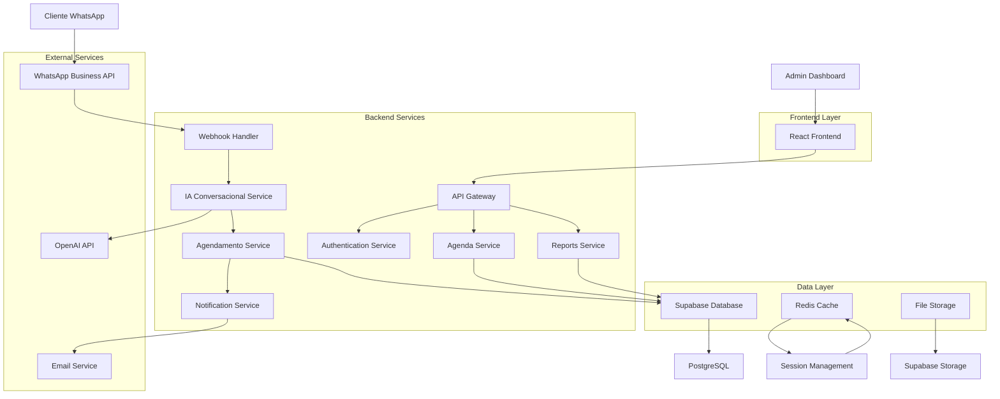
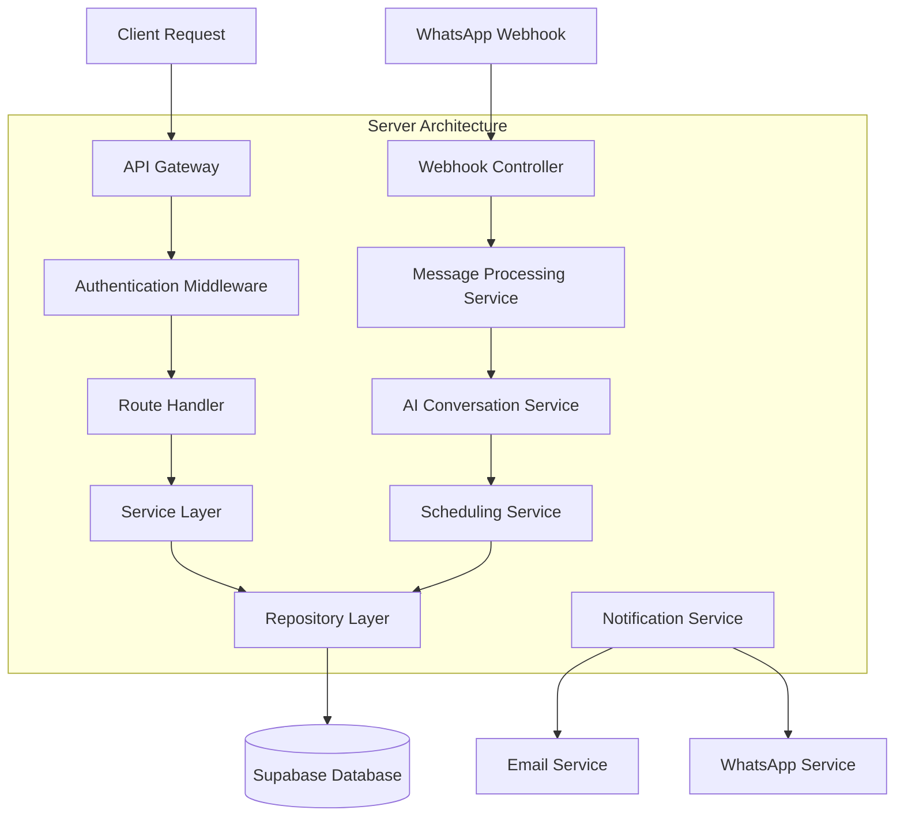
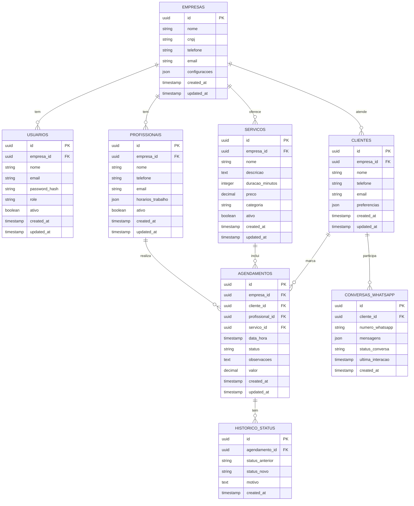

# Arquitetura Técnica - Sis IA Go - Agendamento Inteligente

## 1. Architecture Design



## 2. Technology Description

* **Frontend**: React\@18 + TypeScript + Tailwind CSS + Vite + React Query

* **Backend**: Node.js + Express\@4 + TypeScript + Prisma ORM

* **Database**: Supabase (PostgreSQL) + Redis para cache

* **Authentication**: Supabase Auth + JWT

* **File Storage**: Supabase Storage

* **Real-time**: Socket.io para atualizações em tempo real

* **External APIs**: WhatsApp Business API + OpenAI API

* **Deployment**: Docker + Vercel (Frontend) + Railway (Backend)

## 3. Route Definitions

| Route          | Purpose                                              |
| -------------- | ---------------------------------------------------- |
| /              | Página de login e autenticação                       |
| /dashboard     | Dashboard principal com visão geral dos agendamentos |
| /agenda        | Gestão de agenda multi-profissional                  |
| /servicos      | Cadastro e gestão de serviços                        |
| /clientes      | Base de clientes e histórico                         |
| /relatorios    | Relatórios e analytics                               |
| /configuracoes | Configurações do sistema e WhatsApp                  |
| /modulos       | Painel de liberação de módulos                       |
| /perfil        | Perfil do usuário e configurações pessoais           |

## 4. API Definitions

### 4.1 Core API

**Autenticação**

```
POST /api/auth/login
```

Request:

| Param Name | Param Type | isRequired | Description      |
| ---------- | ---------- | ---------- | ---------------- |
| email      | string     | true       | Email do usuário |
| password   | string     | true       | Senha do usuário |

Response:

| Param Name  | Param Type | Description               |
| ----------- | ---------- | ------------------------- |
| token       | string     | JWT token de autenticação |
| user        | object     | Dados do usuário          |
| permissions | array      | Permissões do usuário     |

**Agendamentos**

```
GET /api/agendamentos
POST /api/agendamentos
PUT /api/agendamentos/:id
DELETE /api/agendamentos/:id
```

Request (POST):

| Param Name     | Param Type | isRequired | Description                |
| -------------- | ---------- | ---------- | -------------------------- |
| clienteId      | string     | true       | ID do cliente              |
| servicoId      | string     | true       | ID do serviço              |
| profissionalId | string     | true       | ID do profissional         |
| dataHora       | datetime   | true       | Data e hora do agendamento |
| observacoes    | string     | false      | Observações adicionais     |

**WhatsApp Webhook**

```
POST /api/webhook/whatsapp
```

Request:

| Param Name | Param Type | isRequired | Description                  |
| ---------- | ---------- | ---------- | ---------------------------- |
| messages   | array      | true       | Array de mensagens recebidas |
| contacts   | array      | true       | Dados dos contatos           |

**Serviços**

```
GET /api/servicos
POST /api/servicos
PUT /api/servicos/:id
DELETE /api/servicos/:id
```

**Profissionais**

```
GET /api/profissionais
POST /api/profissionais
PUT /api/profissionais/:id
DELETE /api/profissionais/:id
```

**Relatórios**

```
GET /api/relatorios/ocupacao
GET /api/relatorios/receita
GET /api/relatorios/no-show
```

## 5. Server Architecture Diagram



## 6. Data Model

### 6.1 Data Model Definition



### 6.2 Data Definition Language

**Tabela Empresas**

```sql
CREATE TABLE empresas (
    id UUID PRIMARY KEY DEFAULT gen_random_uuid(),
    nome VARCHAR(255) NOT NULL,
    cnpj VARCHAR(18) UNIQUE,
    telefone VARCHAR(20),
    email VARCHAR(255),
    configuracoes JSONB DEFAULT '{}',
    created_at TIMESTAMP WITH TIME ZONE DEFAULT NOW(),
    updated_at TIMESTAMP WITH TIME ZONE DEFAULT NOW()
);

CREATE INDEX idx_empresas_cnpj ON empresas(cnpj);
```

**Tabela Usuários**

```sql
CREATE TABLE usuarios (
    id UUID PRIMARY KEY DEFAULT gen_random_uuid(),
    empresa_id UUID REFERENCES empresas(id) ON DELETE CASCADE,
    nome VARCHAR(255) NOT NULL,
    email VARCHAR(255) UNIQUE NOT NULL,
    password_hash VARCHAR(255) NOT NULL,
    role VARCHAR(50) DEFAULT 'user' CHECK (role IN ('admin', 'user', 'professional')),
    ativo BOOLEAN DEFAULT true,
    created_at TIMESTAMP WITH TIME ZONE DEFAULT NOW(),
    updated_at TIMESTAMP WITH TIME ZONE DEFAULT NOW()
);

CREATE INDEX idx_usuarios_empresa_id ON usuarios(empresa_id);
CREATE INDEX idx_usuarios_email ON usuarios(email);
```

**Tabela Profissionais**

```sql
CREATE TABLE profissionais (
    id UUID PRIMARY KEY DEFAULT gen_random_uuid(),
    empresa_id UUID REFERENCES empresas(id) ON DELETE CASCADE,
    nome VARCHAR(255) NOT NULL,
    telefone VARCHAR(20),
    email VARCHAR(255),
    horarios_trabalho JSONB DEFAULT '{}',
    ativo BOOLEAN DEFAULT true,
    created_at TIMESTAMP WITH TIME ZONE DEFAULT NOW(),
    updated_at TIMESTAMP WITH TIME ZONE DEFAULT NOW()
);

CREATE INDEX idx_profissionais_empresa_id ON profissionais(empresa_id);
```

**Tabela Serviços**

```sql
CREATE TABLE servicos (
    id UUID PRIMARY KEY DEFAULT gen_random_uuid(),
    empresa_id UUID REFERENCES empresas(id) ON DELETE CASCADE,
    nome VARCHAR(255) NOT NULL,
    descricao TEXT,
    duracao_minutos INTEGER NOT NULL,
    preco DECIMAL(10,2),
    categoria VARCHAR(100),
    ativo BOOLEAN DEFAULT true,
    created_at TIMESTAMP WITH TIME ZONE DEFAULT NOW(),
    updated_at TIMESTAMP WITH TIME ZONE DEFAULT NOW()
);

CREATE INDEX idx_servicos_empresa_id ON servicos(empresa_id);
CREATE INDEX idx_servicos_categoria ON servicos(categoria);
```

**Tabela Clientes**

```sql
CREATE TABLE clientes (
    id UUID PRIMARY KEY DEFAULT gen_random_uuid(),
    empresa_id UUID REFERENCES empresas(id) ON DELETE CASCADE,
    nome VARCHAR(255) NOT NULL,
    telefone VARCHAR(20) NOT NULL,
    email VARCHAR(255),
    preferencias JSONB
```

