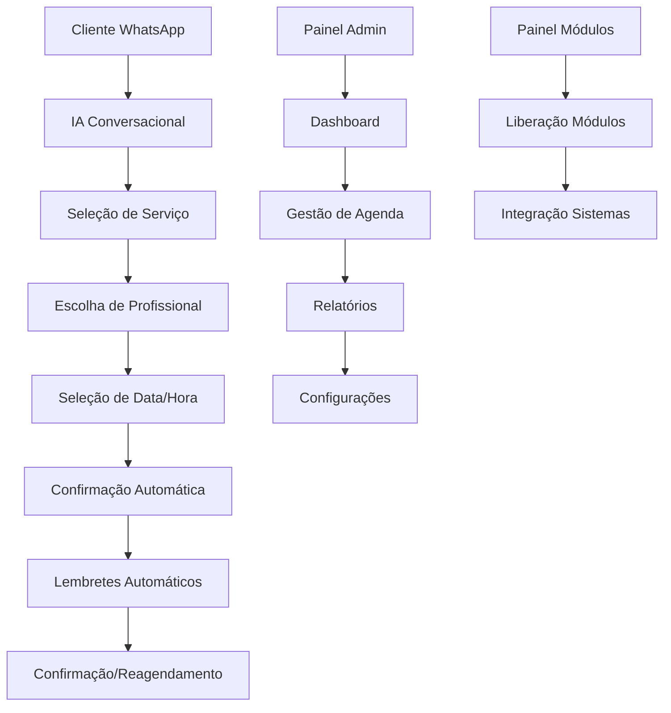

# PRD - Sis IA Go - Agendamento Inteligente

## 1. Product Overview

O **Sis IA Go - Agendamento Inteligente** é um módulo revolucionário do ecossistema Sis IA Go que automatiza 100% do processo de agendamento através de IA conversacional no WhatsApp. O sistema elimina interrupções, otimiza o tempo profissional e reduz drasticamente o no-show, oferecendo experiência moderna tanto para empresas quanto clientes.

O produto resolve o problema de gestão manual de horários, permitindo agendamento 24/7 sem intervenção humana, direcionado a negócios baseados em agendamento que buscam modernização e eficiência operacional.

## 2. Core Features

### 2.1 User Roles

| Role | Registration Method | Core Permissions |
|------|---------------------|------------------|
| Cliente Final | Interação via WhatsApp | Agendar, cancelar, reagendar compromissos |
| Profissional | Convite da empresa | Gerenciar própria agenda, visualizar agendamentos |
| Administrador | Acesso master | Configurar sistema, gerenciar profissionais, relatórios |
| Super Admin | Painel de módulos | Liberar módulos, integração entre sistemas |

### 2.2 Feature Module

Nosso sistema de agendamento inteligente consiste nas seguintes páginas principais:

1. **Dashboard Principal**: visão geral de agendamentos, métricas em tempo real, alertas importantes
2. **Gestão de Agenda**: calendário multi-profissional, bloqueio de horários, configuração de disponibilidade
3. **Cadastro de Serviços**: criação e edição de serviços, definição de duração e valores
4. **Base de Clientes**: histórico automático de clientes, dados de contato, preferências
5. **Relatórios e Analytics**: métricas de ocupação, taxa de no-show, performance por profissional
6. **Configurações do WhatsApp**: integração com API, configuração de mensagens automáticas
7. **Painel de Módulos**: liberação e integração com outros módulos do ecossistema

### 2.3 Page Details

| Page Name | Module Name | Feature description |
|-----------|-------------|---------------------|
| Dashboard Principal | Visão Geral | Exibir agendamentos do dia/semana/mês, estatísticas em tempo real, alertas de conflitos |
| Dashboard Principal | Métricas Rápidas | Mostrar taxa de ocupação, no-shows, receita estimada |
| Gestão de Agenda | Calendário Multi-profissional | Visualizar e editar agenda de múltiplos colaboradores simultaneamente |
| Gestão de Agenda | Bloqueio de Horários | Permitir bloqueio manual de slots para compromissos pessoais ou manutenção |
| Gestão de Agenda | Configuração de Disponibilidade | Definir horários de trabalho, pausas, férias por profissional |
| Cadastro de Serviços | Criação de Serviços | Cadastrar nome, duração, valor, profissional responsável |
| Cadastro de Serviços | Gestão de Categorias | Organizar serviços por categorias para melhor navegação |
| Base de Clientes | Histórico Automático | Registrar automaticamente clientes que interagem via WhatsApp |
| Base de Clientes | Perfil do Cliente | Exibir histórico de agendamentos, preferências, dados de contato |
| Relatórios e Analytics | Métricas de Performance | Gerar relatórios de ocupação, receita, performance por profissional |
| Relatórios e Analytics | Análise de No-show | Identificar padrões de faltas e sugerir ações preventivas |
| Configurações WhatsApp | Integração API | Configurar conexão com WhatsApp Business API |
| Configurações WhatsApp | Mensagens Automáticas | Personalizar templates de confirmação, lembretes, cancelamentos |
| Painel de Módulos | Liberação de Módulos | Ativar/desativar módulos adicionais do ecossistema |
| Painel de Módulos | Integração entre Sistemas | Configurar comunicação entre módulos (gestão comercial, atendimento) |

## 3. Core Process

### Fluxo do Cliente (WhatsApp)
1. Cliente inicia conversa no WhatsApp da empresa
2. IA conversacional apresenta opções de serviços disponíveis
3. Cliente seleciona serviço desejado
4. Sistema mostra profissionais disponíveis para o serviço
5. Cliente escolhe profissional
6. Sistema apresenta datas e horários livres em tempo real
7. Cliente confirma agendamento
8. Sistema envia confirmação automática com detalhes completos
9. Sistema envia lembretes automáticos (24h e 2h antes)
10. Cliente pode confirmar presença, reagendar ou cancelar via WhatsApp

### Fluxo do Administrador
1. Acesso ao painel de controle via web/mobile
2. Configuração inicial: profissionais, serviços, horários
3. Monitoramento em tempo real dos agendamentos
4. Gestão de conflitos e reagendamentos
5. Análise de relatórios e métricas
6. Configuração de mensagens automáticas
7. Liberação de módulos adicionais conforme necessário

## 4. User Interface Design

### 4.1 Design Style

- **Cores Primárias**: Azul corporativo (#2563EB), Verde WhatsApp (#25D366)
- **Cores Secundárias**: Cinza neutro (#6B7280), Branco (#FFFFFF)
- **Estilo de Botões**: Rounded corners (8px), sombras sutis, estados hover/active
- **Tipografia**: Inter ou Roboto, tamanhos 14px (corpo), 16px (títulos), 24px (headings)
- **Layout**: Card-based design, navegação lateral fixa, design responsivo mobile-first
- **Ícones**: Lucide React ou Heroicons, estilo outline, tamanho 20px padrão
- **Animações**: Transições suaves (300ms), micro-interações para feedback

### 4.2 Page Design Overview

| Page Name | Module Name | UI Elements |
|-----------|-------------|-------------|
| Dashboard Principal | Visão Geral | Cards com métricas, gráficos de linha para tendências, lista de agendamentos com status colorido |
| Dashboard Principal | Métricas Rápidas | Widgets compactos com ícones, números grandes, indicadores de crescimento |
| Gestão de Agenda | Calendário | Grid responsivo, cores por profissional, modal para detalhes, drag-and-drop |
| Gestão de Agenda | Bloqueio de Horários | Toggle switches, date picker, confirmação modal |
| Cadastro de Serviços | Formulários | Inputs com validação em tempo real, upload de imagens, preview cards |
| Base de Clientes | Lista de Clientes | Tabela com busca, filtros, avatar placeholder, badges de status |
| Relatórios | Gráficos | Charts.js ou Recharts, filtros de período, export buttons |
| Configurações WhatsApp | Integração | Status indicators, QR code display, message templates editor |

### 4.3 Responsiveness

O sistema é **mobile-first** com adaptação completa para desktop. Inclui otimização para touch em dispositivos móveis, navegação por gestos, e interface simplificada para telas menores. Breakpoints: 320px (mobile), 768px (tablet), 1024px (desktop).