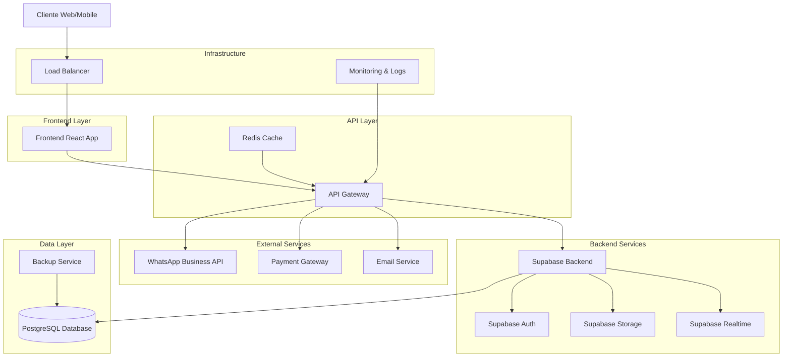
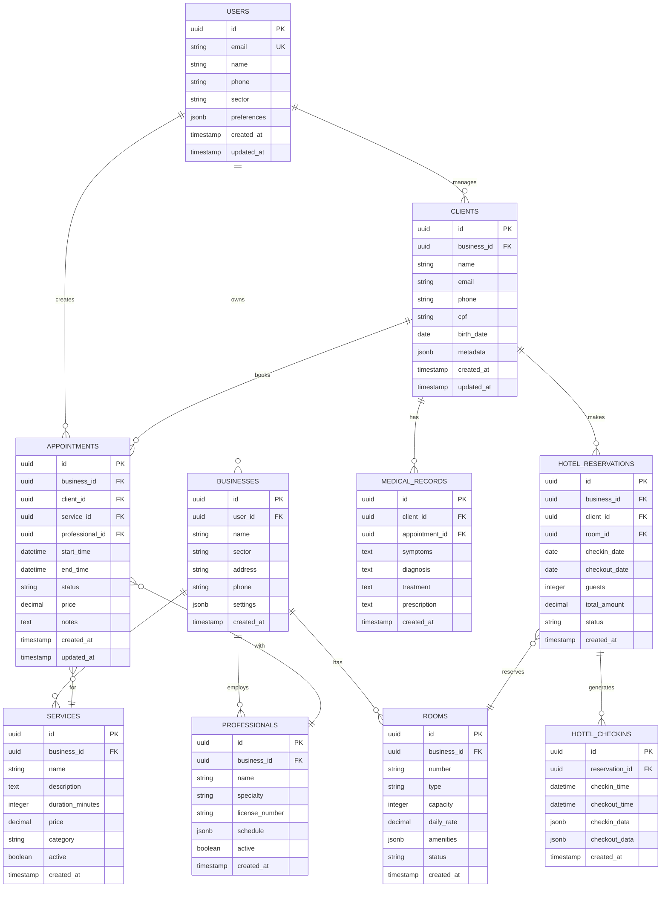

# Arquitetura Técnica Completa - Sis IA Go
## Sistema de Agendamento Inteligente Multi-Setorial

## 1. Arquitetura Geral do Sistema



## 2. Stack Tecnológico Detalhado

### 2.1 Frontend
- **Framework**: React 18 com TypeScript
- **Build Tool**: Vite 5.x
- **Styling**: Tailwind CSS 3.x
- **State Management**: Zustand + React Query
- **Routing**: React Router v6
- **Forms**: React Hook Form + Zod
- **UI Components**: Radix UI + Custom Components
- **Charts**: Recharts
- **Date/Time**: date-fns
- **Icons**: Lucide React

### 2.2 Backend
- **BaaS**: Supabase (PostgreSQL + Auth + Storage + Realtime)
- **Database**: PostgreSQL 15+
- **Authentication**: Supabase Auth (JWT)
- **File Storage**: Supabase Storage
- **Real-time**: Supabase Realtime
- **Cache**: Redis (para sessões e cache de dados)

### 2.3 Integrações Externas
- **WhatsApp**: WhatsApp Business API
- **Pagamentos**: Stripe + PagSeguro
- **Email**: Resend + SendGrid
- **SMS**: Twilio
- **Calendar**: Google Calendar API
- **Maps**: Google Maps API

### 2.4 DevOps e Infraestrutura
- **Hosting Frontend**: Vercel
- **Hosting Backend**: Supabase Cloud
- **CDN**: Cloudflare
- **Monitoring**: Sentry + Vercel Analytics
- **CI/CD**: GitHub Actions
- **Domain**: Cloudflare DNS

## 3. Estrutura de Rotas Frontend

| Rota | Componente | Descrição | Autenticação |
|------|------------|-----------|-------------|
| `/` | SectorSelection | Seleção de setor | Não |
| `/login` | LoginPage | Página de login | Não |
| `/register` | RegisterPage | Página de registro | Não |
| `/dashboard` | Dashboard | Dashboard principal | Sim |
| `/appointments` | AppointmentsList | Lista de agendamentos | Sim |
| `/appointments/new` | AppointmentForm | Novo agendamento | Sim |
| `/clients` | ClientsList | Lista de clientes | Sim |
| `/clients/:id` | ClientProfile | Perfil do cliente | Sim |
| `/calendar` | CalendarView | Visualização de calendário | Sim |
| `/reports` | ReportsPage | Relatórios e analytics | Sim |
| `/settings` | SettingsPage | Configurações | Sim |
| `/profile` | UserProfile | Perfil do usuário | Sim |

### 3.1 Rotas Específicas por Setor

#### Hotelaria
| Rota | Componente | Descrição |
|------|------------|----------|
| `/hotel-rooms` | HotelRoomsList | Gestão de quartos |
| `/hotel-reservations` | HotelReservationsList | Gestão de reservas |
| `/hotel-checkins` | HotelCheckinsList | Check-ins/Check-outs |
| `/hotel-pricing` | HotelPricingPage | Gestão de tarifas |

#### Saúde
| Rota | Componente | Descrição |
|------|------------|----------|
| `/patients` | PatientsList | Gestão de pacientes |
| `/consultations` | ConsultationsList | Consultas médicas |
| `/medical-records` | MedicalRecordsList | Prontuários |
| `/prescriptions` | PrescriptionsList | Receitas médicas |

#### Beleza
| Rota | Componente | Descrição |
|------|------------|----------|
| `/treatments` | TreatmentsList | Gestão de tratamentos |
| `/professionals` | ProfessionalsList | Gestão de profissionais |
| `/services` | ServicesList | Catálogo de serviços |
| `/beauty-packages` | PackagesList | Pacotes de beleza |

## 4. API Endpoints

### 4.1 Autenticação
```typescript
// Supabase Auth endpoints (built-in)
POST /auth/v1/signup
POST /auth/v1/token
POST /auth/v1/logout
POST /auth/v1/recover
POST /auth/v1/user
```

### 4.2 Core APIs

#### Agendamentos
```typescript
GET    /api/appointments          // Listar agendamentos
POST   /api/appointments          // Criar agendamento
GET    /api/appointments/:id      // Obter agendamento
PUT    /api/appointments/:id      // Atualizar agendamento
DELETE /api/appointments/:id      // Cancelar agendamento
POST   /api/appointments/:id/confirm // Confirmar agendamento
```

#### Clientes
```typescript
GET    /api/clients               // Listar clientes
POST   /api/clients               // Criar cliente
GET    /api/clients/:id           // Obter cliente
PUT    /api/clients/:id           // Atualizar cliente
DELETE /api/clients/:id           // Remover cliente
GET    /api/clients/:id/history   // Histórico do cliente
```

#### Relatórios
```typescript
GET    /api/reports/dashboard     // Dados do dashboard
GET    /api/reports/appointments  // Relatório de agendamentos
GET    /api/reports/revenue       // Relatório de receita
GET    /api/reports/occupancy     // Relatório de ocupação
POST   /api/reports/export        // Exportar relatório
```

### 4.3 APIs Específicas por Setor

#### Hotelaria
```typescript
// Quartos
GET    /api/hotel/rooms           // Listar quartos
POST   /api/hotel/rooms           // Criar quarto
PUT    /api/hotel/rooms/:id       // Atualizar quarto
GET    /api/hotel/rooms/availability // Disponibilidade

// Reservas
GET    /api/hotel/reservations    // Listar reservas
POST   /api/hotel/reservations    // Criar reserva
PUT    /api/hotel/reservations/:id // Atualizar reserva
POST   /api/hotel/checkin         // Check-in
POST   /api/hotel/checkout        // Check-out

// Tarifas
GET    /api/hotel/pricing         // Obter tarifas
PUT    /api/hotel/pricing         // Atualizar tarifas
```

#### Saúde
```typescript
// Pacientes
GET    /api/health/patients       // Listar pacientes
POST   /api/health/patients       // Criar paciente
GET    /api/health/patients/:id/records // Prontuários

// Consultas
GET    /api/health/consultations  // Listar consultas
POST   /api/health/consultations  // Agendar consulta
PUT    /api/health/consultations/:id // Atualizar consulta
```

## 5. Modelo de Dados

### 5.1 Diagrama ER



### 5.2 Schemas SQL

#### Tabelas Core
```sql
-- Usuários
CREATE TABLE users (
    id UUID PRIMARY KEY DEFAULT gen_random_uuid(),
    email VARCHAR(255) UNIQUE NOT NULL,
    name VARCHAR(100) NOT NULL,
    phone VARCHAR(20),
    sector VARCHAR(50) DEFAULT 'general',
    preferences JSONB DEFAULT '{}',
    created_at TIMESTAMP WITH TIME ZONE DEFAULT NOW(),
    updated_at TIMESTAMP WITH TIME ZONE DEFAULT NOW()
);

-- Negócios
CREATE TABLE businesses (
    id UUID PRIMARY KEY DEFAULT gen_random_uuid(),
    user_id UUID REFERENCES users(id) ON DELETE CASCADE,
    name VARCHAR(200) NOT NULL,
    sector VARCHAR(50) NOT NULL,
    address TEXT,
    phone VARCHAR(20),
    settings JSONB DEFAULT '{}',
    created_at TIMESTAMP WITH TIME ZONE DEFAULT NOW()
);

-- Clientes
CREATE TABLE clients (
    id UUID PRIMARY KEY DEFAULT gen_random_uuid(),
    business_id UUID REFERENCES businesses(id) ON DELETE CASCADE,
    name VARCHAR(100) NOT NULL,
    email VARCHAR(255),
    phone VARCHAR(20),
    cpf VARCHAR(14),
    birth_date DATE,
    metadata JSONB DEFAULT '{}',
    created_at TIMESTAMP WITH TIME ZONE DEFAULT NOW(),
    updated_at TIMESTAMP WITH TIME ZONE DEFAULT NOW()
);

-- Serviços
CREATE TABLE services (
    id UUID PRIMARY KEY DEFAULT gen_random_uuid(),
    business_id UUID REFERENCES businesses(id) ON DELETE CASCADE,
    name VARCHAR(200) NOT NULL,
    description TEXT,
    duration_minutes INTEGER NOT NULL DEFAULT 60,
    price DECIMAL(10,2) NOT NULL DEFAULT 0,
    category VARCHAR(100),
    active BOOLEAN DEFAULT true,
    created_at TIMESTAMP WITH TIME ZONE DEFAULT NOW()
);

-- Profissionais
CREATE TABLE professionals (
    id UUID PRIMARY KEY DEFAULT gen_random_uuid(),
    business_id UUID REFERENCES businesses(id) ON DELETE CASCADE,
    name VARCHAR(100) NOT NULL,
    specialty VARCHAR(100),
    license_number VARCHAR(50),
    schedule JSONB DEFAULT '{}',
    active BOOLEAN DEFAULT true,
    created_at TIMESTAMP WITH TIME ZONE DEFAULT NOW()
);

-- Agendamentos
CREATE TABLE appointments (
    id UUID PRIMARY KEY DEFAULT gen_random_uuid(),
    business_id UUID REFERENCES businesses(id) ON DELETE CASCADE,
    client_id UUID REFERENCES clients(id) ON DELETE CASCADE,
    service_id UUID REFERENCES services(id) ON DELETE SET NULL,
    professional_id UUID REFERENCES professionals(id) ON DELETE SET NULL,
    start_time TIMESTAMP WITH TIME ZONE NOT NULL,
    end_time TIMESTAMP WITH TIME ZONE NOT NULL,
    status VARCHAR(20) DEFAULT 'scheduled' CHECK (status IN ('scheduled', 'confirmed', 'completed', 'cancelled', 'no_show')),
    price DECIMAL(10,2) DEFAULT 0,
    notes TEXT,
    created_at TIMESTAMP WITH TIME ZONE DEFAULT NOW(),
    updated_at TIMESTAMP WITH TIME ZONE DEFAULT NOW()
);
```

#### Tabelas Específicas - Hotelaria
```sql
-- Quartos
CREATE TABLE hotel_rooms (
    id UUID PRIMARY KEY DEFAULT gen_random_uuid(),
    business_id UUID REFERENCES businesses(id) ON DELETE CASCADE,
    number VARCHAR(10) NOT NULL,
    type VARCHAR(50) NOT NULL,
    capacity INTEGER NOT NULL DEFAULT 2,
    daily_rate DECIMAL(10,2) NOT NULL,
    amenities JSONB DEFAULT '[]',
    status VARCHAR(20) DEFAULT 'available' CHECK (status IN ('available', 'occupied', 'maintenance', 'cleaning')),
    created_at TIMESTAMP WITH TIME ZONE DEFAULT NOW()
);

-- Reservas de Hotel
CREATE TABLE hotel_reservations (
    id UUID PRIMARY KEY DEFAULT gen_random_uuid(),
    business_id UUID REFERENCES businesses(id) ON DELETE CASCADE,
    client_id UUID REFERENCES clients(id) ON DELETE CASCADE,
    room_id UUID REFERENCES hotel_rooms(id) ON DELETE CASCADE,
    checkin_date DATE NOT NULL,
    checkout_date DATE NOT NULL,
    guests INTEGER NOT NULL DEFAULT 1,
    total_amount DECIMAL(10,2) NOT NULL,
    status VARCHAR(20) DEFAULT 'confirmed' CHECK (status IN ('pending', 'confirmed', 'checked_in', 'checked_out', 'cancelled')),
    created_at TIMESTAMP WITH TIME ZONE DEFAULT NOW()
);

-- Check-ins
CREATE TABLE hotel_checkins (
    id UUID PRIMARY KEY DEFAULT gen_random_uuid(),
    reservation_id UUID REFERENCES hotel_reservations(id) ON DELETE CASCADE,
    checkin_time TIMESTAMP WITH TIME ZONE,
    checkout_time TIMESTAMP WITH TIME ZONE,
    checkin_data JSONB DEFAULT '{}',
    checkout_data JSONB DEFAULT '{}',
    created_at TIMESTAMP WITH TIME ZONE DEFAULT NOW()
);

-- Tarifas
CREATE TABLE hotel_pricing (
    id UUID PRIMARY KEY DEFAULT gen_random_uuid(),
    business_id UUID REFERENCES businesses(id) ON DELETE CASCADE,
    room_type VARCHAR(50) NOT NULL,
    date_from DATE NOT NULL,
    date_to DATE NOT NULL,
    rate DECIMAL(10,2) NOT NULL,
    created_at TIMESTAMP WITH TIME ZONE DEFAULT NOW()
);
```

#### Tabelas Específicas - Saúde
```sql
-- Prontuários Médicos
CREATE TABLE medical_records (
    id UUID PRIMARY KEY DEFAULT gen_random_uuid(),
    client_id UUID REFERENCES clients(id) ON DELETE CASCADE,
    appointment_id UUID REFERENCES appointments(id) ON DELETE SET NULL,
    symptoms TEXT,
    diagnosis TEXT,
    treatment TEXT,
    prescription TEXT,
    created_at TIMESTAMP WITH TIME ZONE DEFAULT NOW()
);

-- Exames
CREATE TABLE medical_exams (
    id UUID PRIMARY KEY DEFAULT gen_random_uuid(),
    client_id UUID REFERENCES clients(id) ON DELETE CASCADE,
    exam_type VARCHAR(100) NOT NULL,
    result TEXT,
    file_url TEXT,
    exam_date DATE NOT NULL,
    created_at TIMESTAMP WITH TIME ZONE DEFAULT NOW()
);
```

### 5.3 Índices e Otimizações
```sql
-- Índices para performance
CREATE INDEX idx_appointments_business_date ON appointments(business_id, start_time);
CREATE INDEX idx_appointments_client ON appointments(client_id);
CREATE INDEX idx_appointments_professional ON appointments(professional_id);
CREATE INDEX idx_clients_business ON clients(business_id);
CREATE INDEX idx_hotel_reservations_dates ON hotel_reservations(checkin_date, checkout_date);
CREATE INDEX idx_hotel_reservations_room ON hotel_reservations(room_id);

-- Índices para busca
CREATE INDEX idx_clients_name ON clients USING gin(to_tsvector('portuguese', name));
CREATE INDEX idx_clients_phone ON clients(phone);
CREATE INDEX idx_clients_email ON clients(email);
```

### 5.4 Row Level Security (RLS)
```sql
-- Habilitar RLS
ALTER TABLE businesses ENABLE ROW LEVEL SECURITY;
ALTER TABLE clients ENABLE ROW LEVEL SECURITY;
ALTER TABLE appointments ENABLE ROW LEVEL SECURITY;
ALTER TABLE services ENABLE ROW LEVEL SECURITY;
ALTER TABLE professionals ENABLE ROW LEVEL SECURITY;
ALTER TABLE hotel_rooms ENABLE ROW LEVEL SECURITY;
ALTER TABLE hotel_reservations ENABLE ROW LEVEL SECURITY;

-- Políticas de segurança
CREATE POLICY "Users can only access their own business data" ON businesses
    FOR ALL USING (user_id = auth.uid());

CREATE POLICY "Users can only access their business clients" ON clients
    FOR ALL USING (business_id IN (
        SELECT id FROM businesses WHERE user_id = auth.uid()
    ));

CREATE POLICY "Users can only access their business appointments" ON appointments
    FOR ALL USING (business_id IN (
        SELECT id FROM businesses WHERE user_id = auth.uid()
    ));
```

## 6. Arquitetura de Componentes Frontend

### 6.1 Estrutura de Pastas
```
src/
├── components/
│   ├── ui/                 # Componentes base (Button, Input, etc.)
│   ├── forms/              # Formulários reutilizáveis
│   ├── layout/             # Layout e navegação
│   ├── charts/             # Componentes de gráficos
│   └── sector-specific/    # Componentes específicos por setor
│       ├── hotel/
│       ├── health/
│       └── beauty/
├── pages/                  # Páginas da aplicação
├── hooks/                  # Custom hooks
├── services/               # Serviços e APIs
├── stores/                 # Estado global (Zustand)
├── utils/                  # Utilitários
├── types/                  # Tipos TypeScript
└── constants/              # Constantes da aplicação
```

### 6.2 Gerenciamento de Estado
```typescript
// stores/authStore.ts
interface AuthState {
  user: User | null;
  session: Session | null;
  loading: boolean;
  signIn: (email: string, password: string) => Promise<void>;
  signOut: () => Promise<void>;
  signUp: (email: string, password: string, name: string) => Promise<void>;
}

// stores/businessStore.ts
interface BusinessState {
  currentBusiness: Business | null;
  businesses: Business[];
  loading: boolean;
  fetchBusinesses: () => Promise<void>;
  selectBusiness: (id: string) => void;
  updateBusiness: (id: string, data: Partial<Business>) => Promise<void>;
}

// stores/appointmentStore.ts
interface AppointmentState {
  appointments: Appointment[];
  loading: boolean;
  filters: AppointmentFilters;
  fetchAppointments: (filters?: AppointmentFilters) => Promise<void>;
  createAppointment: (data: CreateAppointmentData) => Promise<void>;
  updateAppointment: (id: string, data: Partial<Appointment>) => Promise<void>;
  cancelAppointment: (id: string) => Promise<void>;
}
```

## 7. Segurança e Compliance

### 7.1 Autenticação e Autorização
- **JWT Tokens**: Supabase Auth com refresh tokens
- **Row Level Security**: Políticas no banco de dados
- **Rate Limiting**: Proteção contra ataques de força bruta
- **CORS**: Configuração adequada para produção

### 7.2 Proteção de Dados
- **Criptografia**: TLS 1.3 para dados em trânsito
- **Hashing**: bcrypt para senhas
- **Sanitização**: Validação e limpeza de inputs
- **LGPD Compliance**: Consentimento e direito ao esquecimento

### 7.3 Monitoramento e Logs
- **Error Tracking**: Sentry para erros em produção
- **Performance**: Vercel Analytics
- **Security**: Logs de auditoria
- **Uptime**: Monitoramento de disponibilidade

## 8. Performance e Otimização

### 8.1 Frontend
- **Code Splitting**: Lazy loading de rotas
- **Bundle Optimization**: Tree shaking e minificação
- **Image Optimization**: WebP e lazy loading
- **Caching**: Service Workers e cache strategies

### 8.2 Backend
- **Database Indexing**: Índices otimizados
- **Query Optimization**: Queries eficientes
- **Connection Pooling**: Supabase connection pooling
- **CDN**: Cloudflare para assets estáticos

### 8.3 Métricas de Performance
- **Core Web Vitals**: LCP < 2.5s, FID < 100ms, CLS < 0.1
- **Time to Interactive**: < 3s
- **Bundle Size**: < 500KB gzipped
- **API Response Time**: < 200ms (95th percentile)

## 9. Deployment e DevOps

### 9.1 CI/CD Pipeline
```yaml
# .github/workflows/deploy.yml
name: Deploy to Production

on:
  push:
    branches: [main]

jobs:
  test:
    runs-on: ubuntu-latest
    steps:
      - uses: actions/checkout@v3
      - uses: actions/setup-node@v3
      - run: npm ci
      - run: npm run test
      - run: npm run build
      
  deploy:
    needs: test
    runs-on: ubuntu-latest
    steps:
      - uses: actions/checkout@v3
      - uses: vercel/action@v1
        with:
          vercel-token: ${{ secrets.VERCEL_TOKEN }}
```

### 9.2 Ambientes
- **Development**: Local com Supabase local
- **Staging**: Vercel preview com Supabase staging
- **Production**: Vercel production com Supabase production

### 9.3 Backup e Recovery
- **Database Backup**: Backup automático diário
- **File Backup**: Supabase Storage backup
- **Code Backup**: Git repository
- **Recovery Time**: < 1 hora

## 10. Conclusão

Esta arquitetura técnica fornece uma base sólida e escalável para o sistema Sis IA Go, garantindo:

- **Escalabilidade**: Suporte a milhares de usuários
- **Segurança**: Proteção robusta de dados
- **Performance**: Carregamento rápido e responsivo
- **Manutenibilidade**: Código limpo e bem estruturado
- **Flexibilidade**: Adaptável a diferentes setores

A implementação seguindo esta arquitetura resultará em um sistema robusto, seguro e pronto para produção.

---
*Documento criado em: Janeiro 2025*  
*Versão: 1.0*  
*Status: Aprovação Pendente*